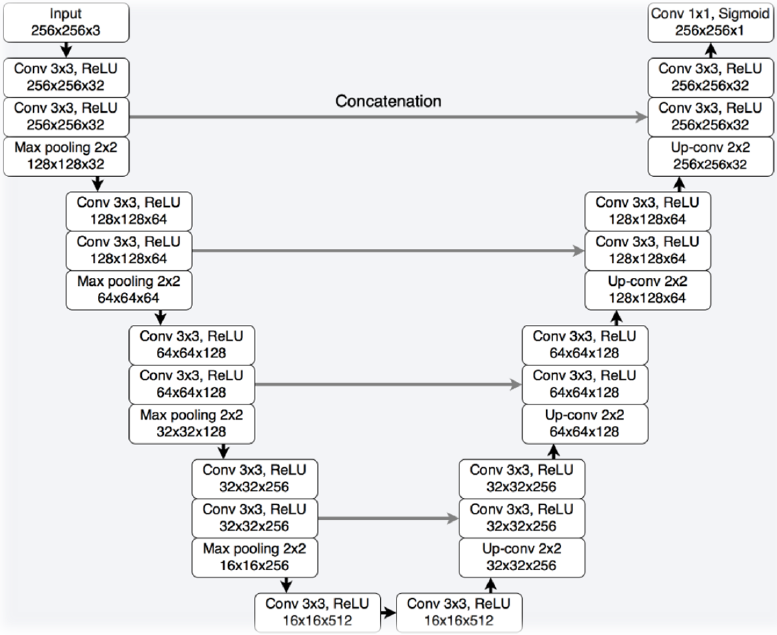
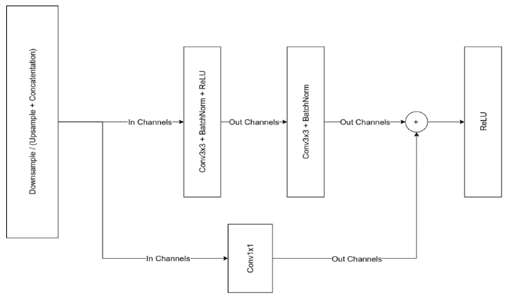
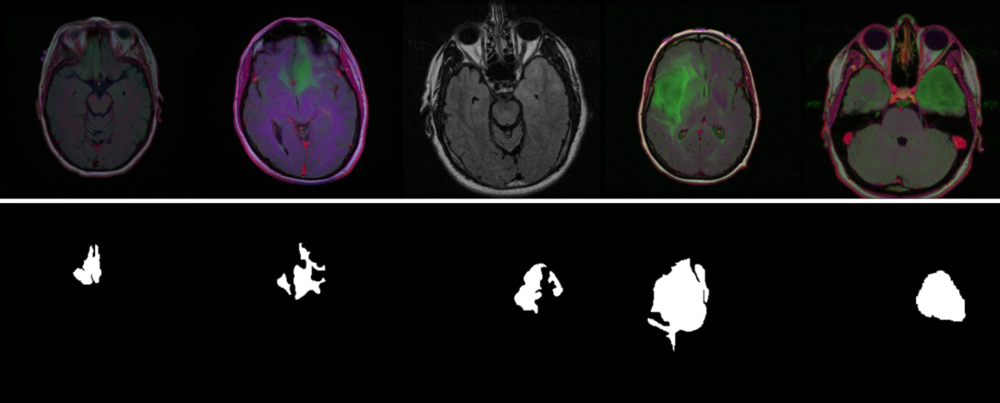
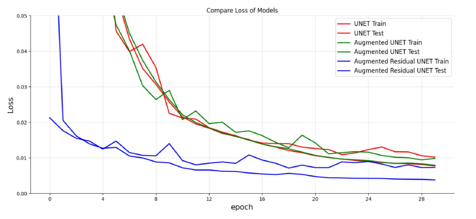
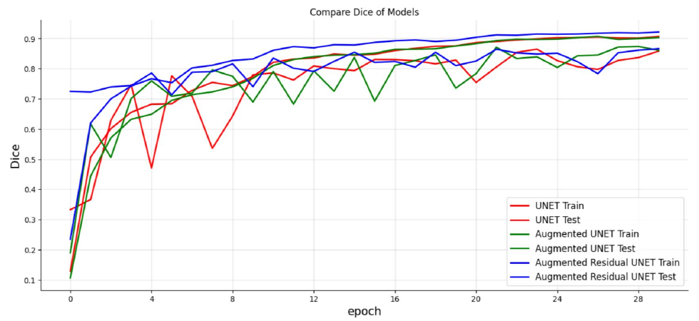
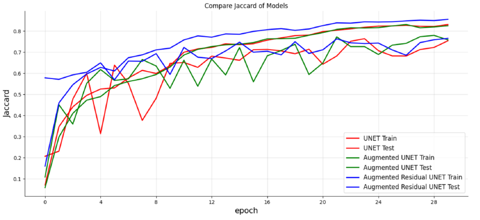
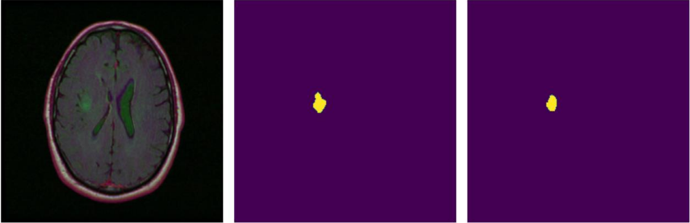
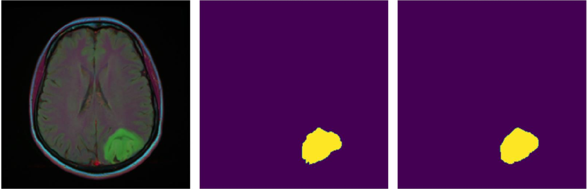
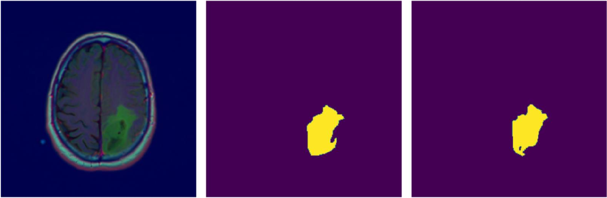
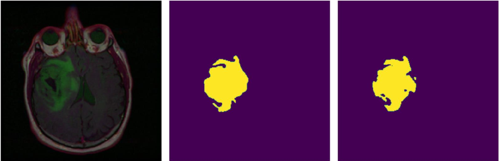

## Introduction

Segmentation is a fundamental concept in computer vision, image processing, and pattern recognition. It involves the partitioning of an image or signal into multiple regions or segments, each of which corresponds to a different object or part of the image. Segmentation can be used for various purposes, such as object recognition, tracking, and classification

MRI segmentation is the process of dividing an image into multiple segments or regions of interest. This technique is important in medical imaging for identifying and isolating specific structures or regions within an image. Various techniques have been developed for MRI segmentation, including deep learning methods using convolutional neural networks. Accurate and efficient segmentation can greatly aid in the diagnosis and treatment of various medical conditions.

## Model Architecture

In this project, we implemented a residual-UNET model. The UNET model architecture can be seen in the figure below. 

<table style="text-align: center margin-left: auto; margin-right: auto; text-align: center" border=0 align=center>
	<thead>
	</thead>
    <tbody style="text-align: center margin-left: auto; margin-right: auto; text-align: center" border=0 align=center>
        <tr>
            <td>
                
            </td>
        </tr>
        <tr>
        	<td colspan=1>
        		Standard U-Net
        	</td>
        </tr>
    </tbody>
</table>


<br>
The Residual-Unet model employs residual connections, which allow for an improved flow of gradients during training. By utilizing residual connections, we can more efficiently propagate information through the network, which can lead to faster convergence during training. Overall, the use of residual connections in the Residual-Unet architecture can significantly enhance the performance of the model, particularly in tasks that require deep neural networks.

<table style="text-align: center margin-left: auto; margin-right: auto; text-align: center" border=0 align=center>
	<thead>
	</thead>
    <tbody style="text-align: center margin-left: auto; margin-right: auto; text-align: center" border=0 align=center>
        <tr>
            <td>
                
            </td>
        </tr>
        <tr>
        	<td colspan=1>
        		Residual block
        	</td>
        </tr>
    </tbody>
</table>

## Dataset

The dataset consists of magnetic resonance (MR) images of the brain along with manually-segmented fluid-attenuated inversion recovery (FLAIR) abnormality masks. These images were sourced from The Cancer Imaging Archive (TCIA) and correspond to a cohort of 110 patients who were part of The Cancer Genome Atlas (TCGA) lower-grade glioma collection. Each patient has at least one FLAIR sequence and genomic cluster data available.

The data for each patient is contained within a single folder, resulting in a total of 110 directories, each corresponding to a different patient. The functional magnetic resonance imaging (fMRI) images in each directory are of size 256 x 256. The labels for each fMRI image are also images of size 256 x 256, and their filenames end with the keyword mask

<table style="text-align: center margin-left: auto; margin-right: auto; text-align: center" border=0 align=center>
	<thead>
	</thead>
    <tbody style="text-align: center margin-left: auto; margin-right: auto; text-align: center" border=0 align=center>
        <tr>
            <td>
                
            </td>
        </tr>
        <tr>
        	<td colspan=1>
        		Samples of fMRI images and corresponding labels
        	</td>
        </tr>
    </tbody>
</table>

<br>
To access the dataset, click on <a href="https://www.kaggle.com/datasets/mateuszbuda/lgg-mri-segmentation?datasetId=181273&sortBy=voteCount">Here</a>

<br>

## Requirement
First, you need to install the required dependencies. You can do this by running the following command in your terminal:

```
make requirements
```

This command will automatically install all the necessary libraries and dependencies needed to run the code in this repository. Make sure you have the required libraries installed before proceeding with the next steps.


## 3.Training

All three models mentioned above are trained using the CIFAR-10 dataset and different loss functions. 

After installing the required dependencies, for instance, you can run the following command to for training the model with default arguments.
```
./train.sh
```

If you want to customize other options, you can run the following command and choose the arguments you want to modify.
```
python train.py --help
```

## Results
In this section, we compare the results of three models: Standard-Unet, Residual-Unet, and Residual-Unet with augmented data. 

<table style="text-align: center margin-left: auto; margin-right: auto; text-align: center" border=0 align=center>
	<thead>
		<tr>
            <th style="text-align: center;">Loss</th>
            <th style="text-align: center;"></th>
		</tr>
	</thead>
    <tbody style="text-align: center margin-left: auto; margin-right: auto; text-align: center" border=0 align=center>
        <tr>
            <td>
                BCE Loss
            </td>
            <td>
                
            </td>
        </tr>
        <tr>
            <td>
                Dice loss
            </td>
            <td>
                
            </td>
        </tr>
        <tr>
            <td>
                Jaccard loss
            </td>
            <td>
                
            </td>
        </tr>
    </tbody>
</table>

Based on the various metrics we analyzed, the third model, Residual-Unet with augmented data, yielded the best results. Therefore, it can be concluded that augmenting the data significantly improved the performance of the Residual-Unet model, making it the most effective model for the given task.

Below are some predictions made by our best-performing model, Residual-Unet with augmented data.

The first column displays the input image, while the second column showcases the mask or ground truth, which serves as a reference for comparison. The last column depicts the predicted mask generated by the model, which is based on the input image and the training it has received

<table style="text-align: center margin-left: auto; margin-right: auto; text-align: center" border=0 align=center>
	<thead>
        <tr>
        </tr>
	</thead>
    <tbody style="text-align: center margin-left: auto; margin-right: auto; text-align: center" border=0 align=center>
        <tr>
            <td>
                
            </td>
        </tr>
        <tr>
            <td>
                
            </td>
        </tr>
        <tr>
            <td>
                
            </td>
        </tr>
        <tr>
            <td>
                
            </td>
        </tr>
    </tbody>
</table>


## Conclusion

The use of residual connections can significantly expedite the convergence process in a model designed for segmentation, as demonstrated by the comparison of metric plots. Furthermore, augmenting data can improve the generalization of our segmentation model and enhance its performance on unseen data. By incorporating these techniques, we can create a more robust and efficient model for segmentation


